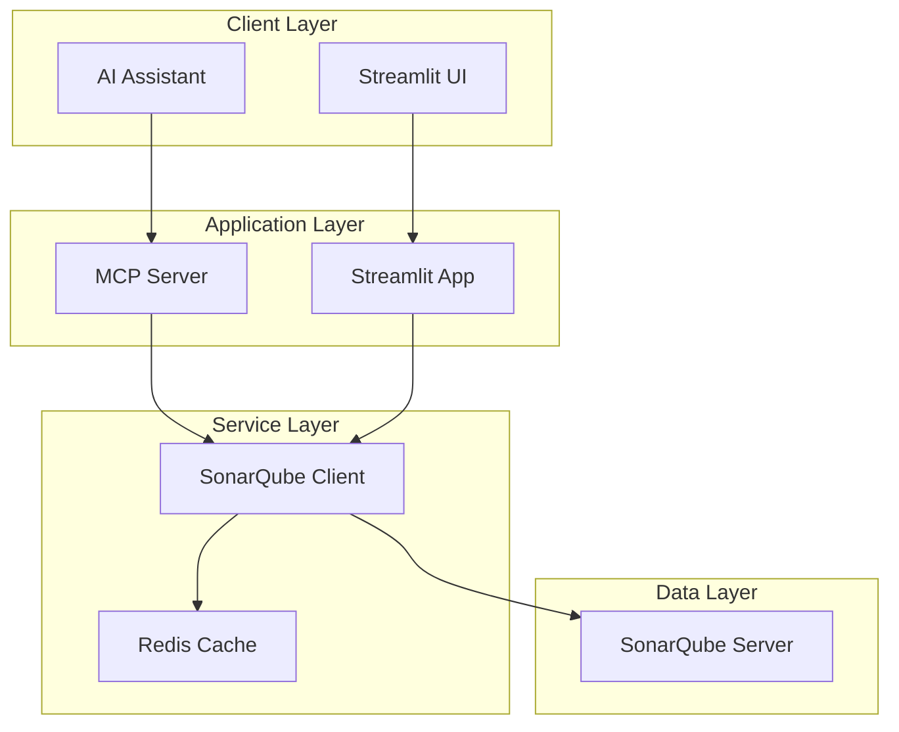

# SonarQube MCP Integration

A comprehensive Model Context Protocol (MCP) server that enables seamless integration between AI assistants and SonarQube, facilitating code quality analysis, project management, and metrics consultation through natural language interactions.

## 🚀 Features

### Core Capabilities
- **Natural Language Interface**: Interact with SonarQube using conversational AI
- **Comprehensive Project Management**: Create, manage, and analyze projects
- **Quality Metrics Analysis**: Real-time code quality and coverage metrics
- **Issue Management**: Search, assign, and track code issues
- **Security Analysis**: Vulnerability detection and security hotspot management
- **Quality Gates**: Monitor and manage quality gate status
- **Interactive Dashboard**: Web-based UI for visualization and configuration

### Technical Features
- **MCP Protocol Compliance**: Full implementation of Model Context Protocol
- **High Performance**: Redis caching and connection pooling
- **Scalable Architecture**: Kubernetes-ready with horizontal scaling
- **Security First**: Token-based authentication and comprehensive security measures
- **Production Ready**: Docker containers, monitoring, and backup solutions

## 📋 Prerequisites

- **Python 3.11+**
- **SonarQube 9.9+** (Community or Enterprise Edition)
- **Docker 20.10+** (for containerized deployment)
- **Kubernetes 1.25+** (for production deployment)
- **Redis** (optional, for caching)

## 🛠️ Quick Start

### Option 1: Docker Compose (Recommended)

1. **Clone the repository**:
   ```bash
   git clone https://github.com/your-org/sonarqube-mcp.git
   cd sonarqube-mcp
   ```

2. **Configure environment**:
   ```bash
   # Copy and edit the development environment file
   cp docker/environments/.env.development docker/environments/.env.development.local
   
   # Edit the file and replace 'your_sonarqube_token_here' with your actual token
   nano docker/environments/.env.development.local
   ```

3. **Start the services**:
   ```bash
   # Start all services with development configuration
   docker compose -f docker/compose/base/docker-compose.yml \
                   -f docker/compose/environments/development.yml \
                   --env-file docker/environments/.env.development \
                   up --build
   ```

4. **Access applications**:

| Service | URL | Port | Credentials |
|---------|-----|------|-------------|
| **Streamlit UI** | http://localhost:8501 | 8501 | - |
| **SonarQube** | http://localhost:9000/sonarqube | 9000 | admin / admin |
| **MCP Server** | http://localhost:8001/health | 8001 | - |
| **pgAdmin** | http://localhost:8082 | 8082 | admin@example.com / admin |
| **Redis Commander** | http://localhost:8081 | 8081 | - |
| **Mailhog** | http://localhost:8025 | 8025 | - |
| **PostgreSQL** | localhost:5432 | 5432 | sonarqube / sonarqube_dev_password |
| **Redis** | localhost:6379 | 6379 | redis_dev_password |

5. **Configure SonarQube connection**:
   - Open Streamlit app at http://localhost:8501
   - Go to Configuration page
   - Enter SonarQube URL: `http://localhost:9000/sonarqube`
   - Enter your SonarQube token
   - Test and save configuration

📖 **For detailed Docker configuration, see [docker/README.md](docker/README.md)**

#### Docker Helper Script

For convenience, use the Docker helper script:

```bash
# Make the script executable (Linux/Mac)
chmod +x scripts/docker-helper.sh

# Initial setup
./scripts/docker-helper.sh setup

# Start services
./scripts/docker-helper.sh start

# Check status and URLs
./scripts/docker-helper.sh status
./scripts/docker-helper.sh urls

# View logs
./scripts/docker-helper.sh logs mcp-server

# Open shell in container
./scripts/docker-helper.sh shell postgres

# For help with all commands
./scripts/docker-helper.sh
```

### Option 2: Local Development

1. **Install dependencies**:
   ```bash
   python -m venv venv
   source venv/bin/activate  # On Windows: venv\Scripts\activate
   pip install -r requirements.txt
   ```

2. **Configure environment**:
   ```bash
   export SONARQUBE_URL="https://your-sonarqube-instance.com"
   export SONARQUBE_TOKEN="your_sonarqube_token"
   ```

3. **Start services**:
   ```bash
   # Terminal 1: Start MCP Server
   python -m src.mcp_server.server
   
   # Terminal 2: Start Streamlit App
   streamlit run src/streamlit_app/app.py
   ```

### Option 3: Kubernetes Production Deployment

1. **Deploy infrastructure**:
   ```bash
   kubectl apply -f k8s/namespace.yaml
   kubectl apply -f k8s/secrets.yaml
   kubectl apply -f k8s/postgres.yaml
   kubectl apply -f k8s/redis.yaml
   ```

2. **Deploy applications**:
   ```bash
   kubectl apply -f k8s/mcp-server.yaml
   kubectl apply -f k8s/streamlit-app.yaml
   kubectl apply -f k8s/ingress.yaml
   ```

3. **Deploy monitoring** (optional):
   ```bash
   kubectl apply -f k8s/monitoring/
   ```

## 📖 Documentation

### User Documentation
- [Setup Guide](docs/user-guide/setup-guide.md) - Complete installation and configuration guide
- [API Documentation](docs/api/mcp-tools.md) - Comprehensive API reference
- [Troubleshooting Guide](docs/troubleshooting/common-issues.md) - Common issues and solutions

### Developer Documentation
- [Architecture Overview](docs/developer/architecture.md) - System architecture and design
- [Contributing Guide](CONTRIBUTING.md) - How to contribute to the project
- [Development Setup](docs/developer/development.md) - Local development environment

### Docker Documentation
- [Docker Setup Guide](docker/README.md) - Complete Docker configuration guide
- [Configuration Files](docker/config/README.md) - Service configuration documentation

## 🔧 Configuration

### Environment Variables

| Variable | Description | Required | Default |
|----------|-------------|----------|---------|
| `SONARQUBE_URL` | SonarQube instance URL | Yes | - |
| `SONARQUBE_TOKEN` | SonarQube user token | Yes | - |
| `SONARQUBE_ORGANIZATION` | Organization key (SonarCloud) | No | - |
| `REDIS_URL` | Redis connection URL | No | `redis://localhost:6379/0` |
| `CACHE_TTL` | Cache time-to-live (seconds) | No | `300` |
| `LOG_LEVEL` | Logging level | No | `INFO` |

### SonarQube Token Setup

1. Log into your SonarQube instance
2. Go to **My Account** → **Security**
3. Generate a new token with appropriate permissions:
   - Browse projects
   - Execute analysis
   - Administer issues
   - Administer security hotspots

## 🎯 Usage Examples

### MCP Tool Usage

```json
{
  "name": "list_projects",
  "arguments": {
    "search": "my-project",
    "page": 1,
    "page_size": 50
  }
}
```

```json
{
  "name": "get_measures",
  "arguments": {
    "component": "my-project",
    "metric_keys": "coverage,bugs,vulnerabilities,code_smells"
  }
}
```

```json
{
  "name": "search_issues",
  "arguments": {
    "componentKeys": "my-project",
    "severities": "MAJOR,CRITICAL",
    "statuses": "OPEN"
  }
}
```

### Natural Language Queries

With an AI assistant connected to the MCP server:

- "Show me the code coverage for my-project"
- "List all critical issues in the authentication module"
- "What's the quality gate status for the latest build?"
- "Assign all security vulnerabilities to john.doe"

## 🏗️ Architecture



## 🔒 Security

- **Token-based Authentication**: Secure SonarQube token authentication
- **HTTPS Enforcement**: All communications encrypted in transit
- **Input Validation**: Comprehensive input sanitization and validation
- **RBAC Support**: Role-based access control through SonarQube permissions
- **Security Hardening**: Container security best practices

## 📊 Monitoring

### Health Checks
- MCP Server: `GET /health`
- Streamlit App: `GET /_stcore/health`
- SonarQube: `GET /api/system/status`

### Metrics (Prometheus)
- Request count and duration
- Cache hit ratio
- Error rates
- Active connections

### Logging
- Structured JSON logging
- Request/response tracing
- Error tracking
- Performance metrics

## 🚀 Deployment

### Production Checklist

- [ ] Configure HTTPS/TLS certificates
- [ ] Set up monitoring and alerting
- [ ] Configure backup procedures
- [ ] Implement log aggregation
- [ ] Set resource limits and auto-scaling
- [ ] Configure network policies
- [ ] Set up CI/CD pipeline

### Scaling Considerations

- **Horizontal Scaling**: MCP Server and Streamlit App are stateless
- **Caching**: Redis cluster for distributed caching
- **Load Balancing**: Nginx or cloud load balancer
- **Database**: SonarQube with PostgreSQL master/replica setup

## 🧪 Testing

```bash
# Run unit tests
pytest tests/unit/ -v

# Run integration tests
pytest tests/integration/ -v

# Run with coverage
pytest --cov=src --cov-report=html

# Run linting
ruff check src/ tests/
black --check src/ tests/
mypy src/
```

## 🤝 Contributing

We welcome contributions! Please see our [Contributing Guide](CONTRIBUTING.md) for details.

### Development Setup

1. Fork the repository
2. Create a feature branch
3. Make your changes
4. Add tests
5. Run the test suite
6. Submit a pull request

## 📄 License

This project is licensed under the MIT License - see the [LICENSE](LICENSE) file for details.

## 🆘 Support

- **Documentation**: Check our comprehensive [documentation](docs/)
- **Issues**: Report bugs or request features via [GitHub Issues](https://github.com/your-org/sonarqube-mcp/issues)
- **Discussions**: Join community discussions in [GitHub Discussions](https://github.com/your-org/sonarqube-mcp/discussions)
- **Security**: Report security issues to security@yourorg.com

## 🗺️ Roadmap

### Current Version (v1.1.0) - Latest Release
- ✅ Core MCP protocol implementation
- ✅ SonarQube integration
- ✅ Streamlit web interface
- ✅ Docker containerization
- ✅ Kubernetes deployment
- ✅ **NEW**: Fixed MCP server port consistency (8001)
- ✅ **NEW**: Improved error handling and session state management
- ✅ **NEW**: Updated Streamlit compatibility (v1.50+)
- ✅ **NEW**: Enhanced Docker configuration and health checks
- ✅ **NEW**: Production-ready configuration templates

### Upcoming Features (v1.2)
- [ ] Advanced analytics and reporting
- [ ] Custom quality gate templates
- [ ] Webhook integrations
- [ ] Multi-tenant support
- [ ] Enhanced security features
- [ ] Real-time notifications
- [ ] Improved caching strategies

### Future Enhancements (v2.0)
- [ ] Machine learning insights
- [ ] Advanced visualization
- [ ] Plugin architecture
- [ ] Mobile application
- [ ] Enterprise features

## 📈 Performance

### Benchmarks
- **Response Time**: < 2 seconds for most operations
- **Throughput**: 100+ requests per minute per instance
- **Cache Hit Ratio**: > 70% with proper configuration
- **Memory Usage**: < 512MB per service instance

### Optimization Tips
- Enable Redis caching for better performance
- Use connection pooling for high-throughput scenarios
- Configure appropriate resource limits
- Monitor and tune cache TTL values

## 📝 Changelog

### v1.1.0 (2024-10-24) - Stability and Configuration Updates

#### 🔧 **Fixed**
- **MCP Server Port Consistency**: Standardized MCP server port to 8001 across all configurations
- **Session State Errors**: Fixed Streamlit session state initialization issues
- **Deprecation Warnings**: Updated `use_container_width` to `width="stretch"` for Streamlit 1.50+
- **Docker Compose Syntax**: Removed obsolete version field from production configuration
- **Health Check Recursion**: Fixed infinite recursion in MCP client health checks

#### 🚀 **Improved**
- **Error Handling**: Enhanced error handling with graceful fallbacks
- **Async Operations**: Better async/await patterns in MCP client
- **Docker Configuration**: Cleaned up production overrides and service definitions
- **Logging**: Improved structured logging with better error tracking
- **Documentation**: Updated README files with current configurations and troubleshooting

#### 🔒 **Security**
- **Container Security**: Improved file permission handling
- **Network Configuration**: Better service isolation and communication
- **Production Templates**: Enhanced production configuration templates

### v1.0.0 (2024-10-20) - Initial Release

#### ✨ **Features**
- Complete MCP protocol implementation
- SonarQube integration with comprehensive API coverage
- Streamlit web interface with real-time data
- Docker containerization with multi-environment support
- Kubernetes deployment configurations
- Redis caching for performance optimization
- Comprehensive monitoring and health checks

## 🏆 Acknowledgments

- [FastMCP](https://github.com/pydantic/fastmcp) - MCP protocol implementation
- [Streamlit](https://streamlit.io/) - Web application framework
- [SonarQube](https://www.sonarqube.org/) - Code quality platform
- [httpx](https://www.python-httpx.org/) - HTTP client library

---

**Made with ❤️ by Moises Tapia (Cl0nR3v)**