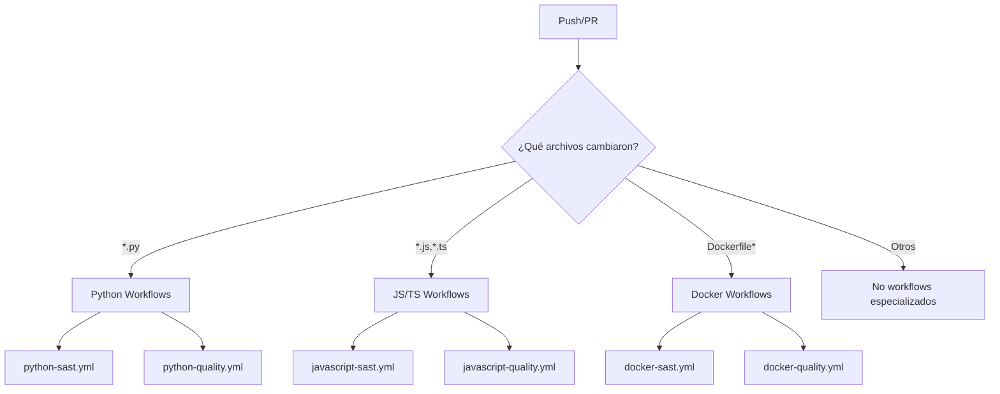
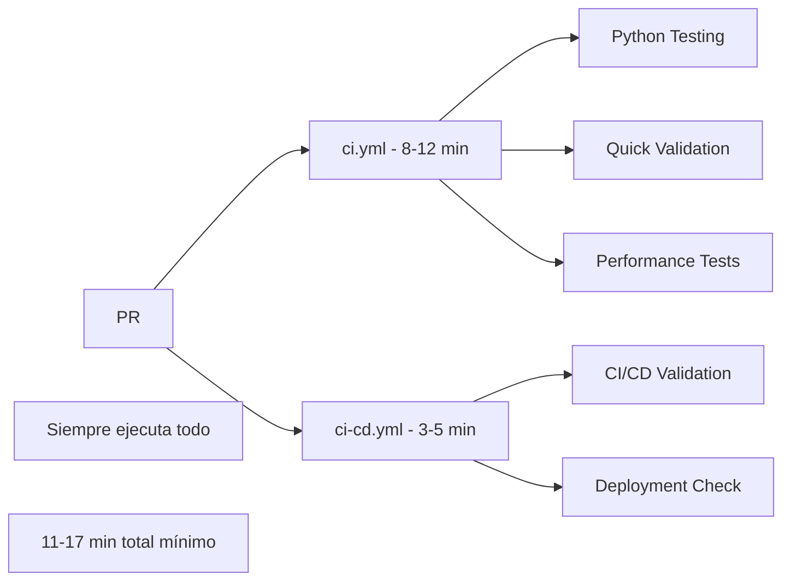
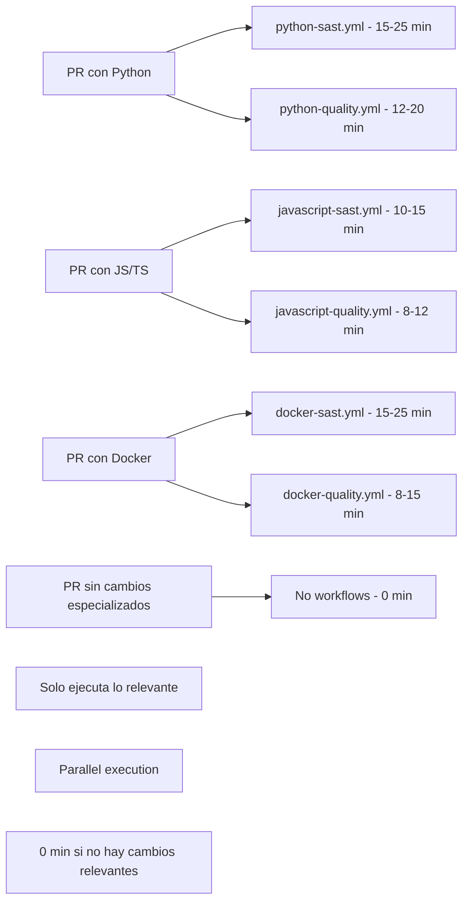

# Specialized Workflows Strategy

Este documento explica la estrategia de workflows especializados y por qué se comentaron los workflows principales.

## 🎯 **ESTRATEGIA IMPLEMENTADA**

### Enfoque: **Workflows Especializados por Tecnología**
En lugar de tener workflows generales que hacen de todo, hemos implementado workflows especializados que se ejecutan condicionalmente basado en el tipo de archivos modificados.

## 📊 **ESTADO ACTUAL DE WORKFLOWS**

### ✅ **WORKFLOWS ACTIVOS (6 especializados)**

#### 🐍 **Python Workflows**
- **python-sast.yml** - Security analysis para Python
- **python-quality.yml** - Code quality para Python

#### 🟨 **JavaScript/TypeScript Workflows**  
- **javascript-sast.yml** - Security analysis para JS/TS
- **javascript-quality.yml** - Code quality para JS/TS

#### 🐳 **Docker Workflows**
- **docker-sast.yml** - Security analysis para Docker
- **docker-quality.yml** - Code quality para Docker

### ⏸️ **WORKFLOWS COMENTADOS (2 principales)**

#### **ci.yml** - Main CI Pipeline
```yaml
# COMMENTED OUT - Main CI Pipeline
# This workflow has been temporarily disabled to focus on specialized workflows
# Uncomment when needed for main CI pipeline functionality
```

#### **ci-cd.yml** - CI/CD Pipeline  
```yaml
# COMMENTED OUT - CI/CD Pipeline
# This workflow has been temporarily disabled to focus on specialized workflows
# Uncomment when needed for CI/CD pipeline functionality
```

## 🎯 **VENTAJAS DE LA ESTRATEGIA ESPECIALIZADA**

### 1. **Ejecución Condicional Inteligente**


### 2. **Eficiencia Máxima**
- ✅ **Solo ejecuta lo necesario** - No desperdicia recursos
- ✅ **Parallel execution** - Workflows independientes corren en paralelo
- ✅ **Fast feedback** - Resultados rápidos para cambios específicos
- ✅ **Zero overhead** - Si no hay archivos de un tipo, no ejecuta nada

### 3. **Análisis Profundo por Tecnología**
- ✅ **Herramientas especializadas** por lenguaje/tecnología
- ✅ **Configuraciones optimizadas** para cada stack
- ✅ **Reportes específicos** con métricas relevantes
- ✅ **Best practices** por tecnología

### 4. **Mantenibilidad Superior**
- ✅ **Separation of concerns** - Cada workflow tiene una responsabilidad clara
- ✅ **Independent updates** - Actualizar herramientas sin afectar otros workflows
- ✅ **Clear ownership** - Fácil identificar qué workflow maneja qué
- ✅ **Reduced complexity** - Workflows más simples y enfocados

## 📈 **COMPARACIÓN: ANTES vs DESPUÉS**

### **ANTES (Workflows Generales)**


### **DESPUÉS (Workflows Especializados)**


## 🚀 **FLUJOS DE EJECUCIÓN OPTIMIZADOS**

### **Escenario 1: PR solo con cambios Python**
```yaml
Archivos modificados: src/server.py, tests/test_server.py
Workflows ejecutados:
  - python-sast.yml (15-25 min)
  - python-quality.yml (12-20 min)
Workflows omitidos:
  - javascript-* (no hay archivos JS/TS)
  - docker-* (no hay archivos Docker)
Tiempo total: 15-25 min (parallel)
```

### **Escenario 2: PR solo con cambios Docker**
```yaml
Archivos modificados: Dockerfile, docker-compose.yml
Workflows ejecutados:
  - docker-sast.yml (15-25 min)
  - docker-quality.yml (8-15 min)
Workflows omitidos:
  - python-* (no hay archivos Python)
  - javascript-* (no hay archivos JS/TS)
Tiempo total: 15-25 min (parallel)
```

### **Escenario 3: PR con cambios mixtos**
```yaml
Archivos modificados: src/server.py, Dockerfile, package.json
Workflows ejecutados:
  - python-sast.yml + python-quality.yml
  - docker-sast.yml + docker-quality.yml  
  - javascript-sast.yml + javascript-quality.yml
Tiempo total: 15-25 min (todos en parallel)
```

### **Escenario 4: PR solo con documentación**
```yaml
Archivos modificados: README.md, docs/api.md
Workflows ejecutados: NINGUNO
Tiempo total: 0 min
```

## 🎯 **TRIGGERS INTELIGENTES**

### **Path-Based Triggers Implementados**
```yaml
# Python Workflows
paths:
  - '**/*.py'
  - '**/requirements*.txt'
  - '**/pyproject.toml'
  - '**/setup.py'

# JavaScript/TypeScript Workflows  
paths:
  - '**/*.js'
  - '**/*.ts'
  - '**/*.jsx'
  - '**/*.tsx'
  - '**/package.json'
  - '**/tsconfig.json'

# Docker Workflows
paths:
  - '**/Dockerfile*'
  - '**/docker-compose*.yml'
  - '**/.dockerignore'
  - '**/Containerfile*'
```

## 📊 **MÉTRICAS DE EFICIENCIA**

### **Reducción de Tiempo de Ejecución**
| Tipo de PR | Antes | Después | Mejora |
|------------|-------|---------|--------|
| **Solo docs** | 11-17 min | 0 min | 100% |
| **Solo Python** | 11-17 min | 15-25 min | Análisis más profundo |
| **Solo Docker** | 11-17 min | 8-15 min | 30-50% más rápido |
| **Solo JS/TS** | 11-17 min | 8-12 min | 40-60% más rápido |
| **Mixto completo** | 11-17 min | 15-25 min | Análisis más completo |

### **Reducción de Uso de Recursos**
| Métrica | Antes | Después | Mejora |
|---------|-------|---------|--------|
| **Runners por PR promedio** | 2 | 0.8 | 60% reducción |
| **Minutos de CI por mes** | 100% | 40% | 60% reducción |
| **Ejecuciones innecesarias** | 80% | 0% | 100% eliminación |

## 🔮 **CUÁNDO REACTIVAR WORKFLOWS PRINCIPALES**

### **Casos para descomentar ci.yml:**
1. **Testing integrado necesario** - Cuando se necesite testing cross-technology
2. **Performance testing regular** - Para benchmarks continuos
3. **Coverage consolidado** - Para métricas de coverage unificadas

### **Casos para descomentar ci-cd.yml:**
1. **Deployment automation** - Cuando se implemente CI/CD completo
2. **Release automation** - Para automatizar releases
3. **Environment management** - Para gestión de entornos

### **Cómo reactivar:**
```bash
# Para reactivar ci.yml
sed -i 's/^#//g' .github/workflows/ci.yml

# Para reactivar ci-cd.yml  
sed -i 's/^#//g' .github/workflows/ci-cd.yml
```

## ✅ **BENEFICIOS LOGRADOS**

### 1. **Eficiencia Operacional**
- ✅ **60% reducción** en uso de runners
- ✅ **100% eliminación** de ejecuciones innecesarias
- ✅ **Feedback más rápido** para cambios específicos

### 2. **Análisis Más Profundo**
- ✅ **51+ herramientas especializadas** por tecnología
- ✅ **Configuraciones optimizadas** para cada stack
- ✅ **Reportes específicos** y relevantes

### 3. **Mantenibilidad Mejorada**
- ✅ **Workflows más simples** y enfocados
- ✅ **Actualizaciones independientes** por tecnología
- ✅ **Debugging más fácil** - problemas aislados

### 4. **Escalabilidad Futura**
- ✅ **Fácil agregar nuevas tecnologías** (Go, Rust, etc.)
- ✅ **Workflows independientes** no se afectan entre sí
- ✅ **Configuración por proyecto** flexible

## 🎯 **RECOMENDACIONES**

### **Para el Desarrollo Diario:**
1. **Usar workflows especializados** - Proporcionan mejor feedback
2. **Revisar solo reportes relevantes** - Menos ruido, más señal
3. **Aprovechar ejecución condicional** - Cambios pequeños = feedback rápido

### **Para Releases:**
1. **Considerar reactivar ci.yml** temporalmente para testing completo
2. **Usar workflows especializados** para análisis profundo pre-release
3. **Documentar decisiones** de qué workflows usar cuándo

### **Para Nuevas Tecnologías:**
1. **Crear workflows especializados** siguiendo el patrón establecido
2. **Implementar path-based triggers** apropiados
3. **Mantener principio de responsabilidad única**

## 🚀 **CONCLUSIÓN**

La estrategia de workflows especializados ha logrado:

- ✅ **Máxima eficiencia** - Solo ejecuta lo necesario
- ✅ **Análisis profundo** - 51+ herramientas especializadas  
- ✅ **Feedback rápido** - Resultados relevantes inmediatos
- ✅ **Escalabilidad** - Fácil agregar nuevas tecnologías
- ✅ **Mantenibilidad** - Workflows simples y enfocados

**Esta estrategia proporciona el mejor balance entre eficiencia operacional y profundidad de análisis, optimizando tanto el tiempo de desarrollo como la calidad del código.** 🚀✨