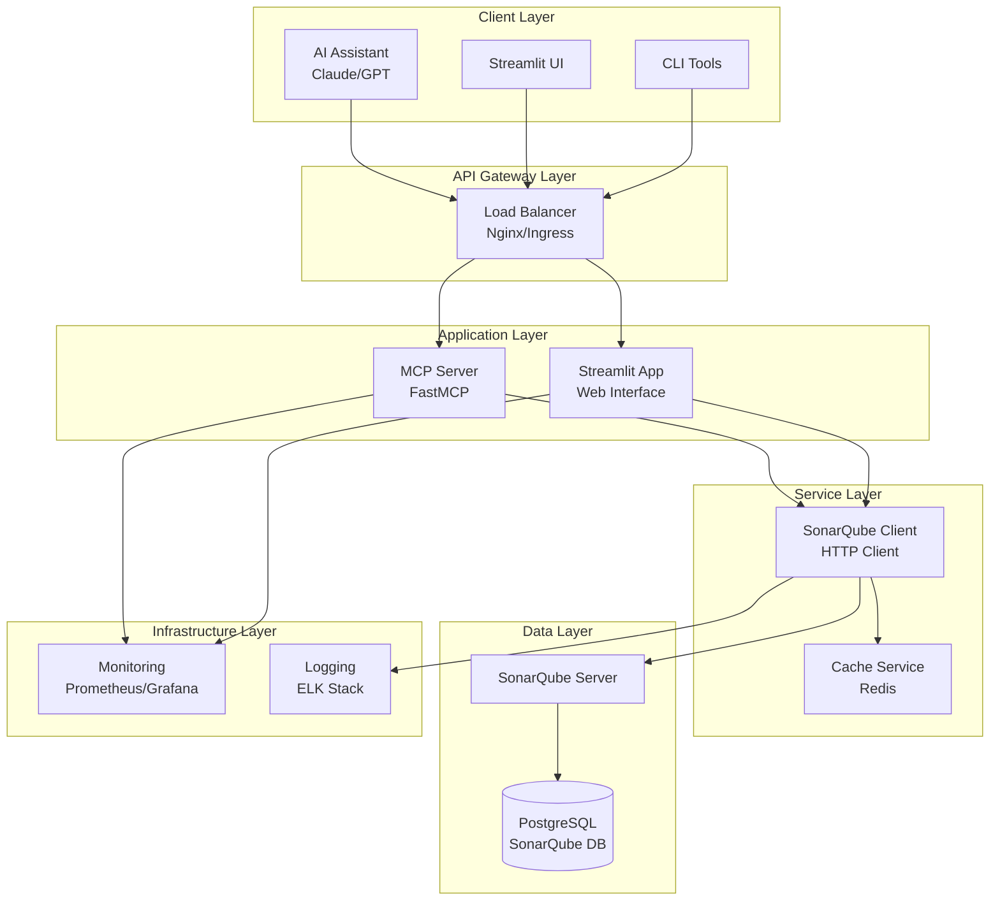
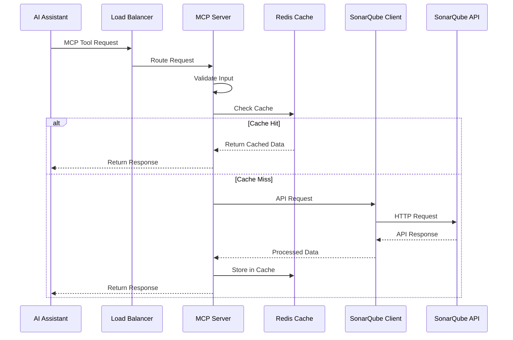
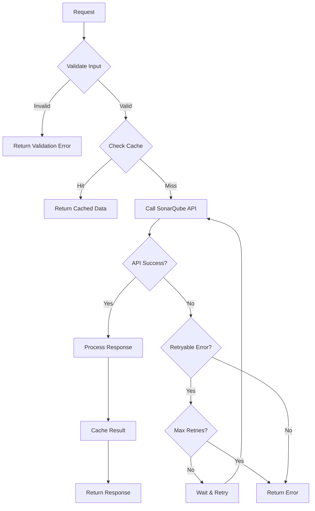
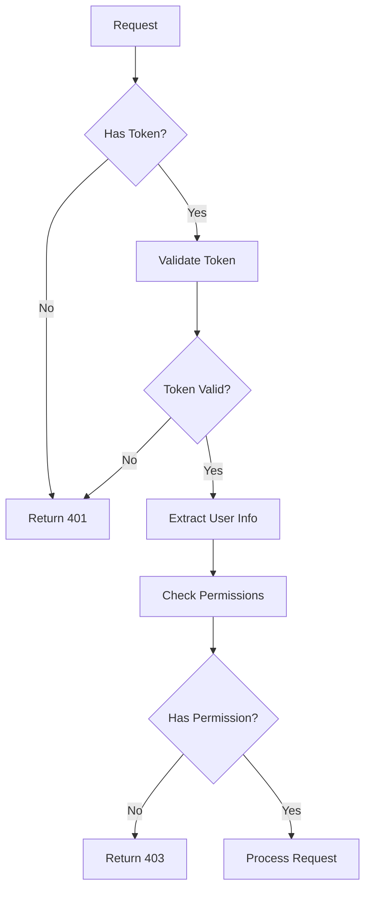

# SonarQube MCP Architecture Documentation

## Overview

The SonarQube MCP system is designed as a distributed, microservices-based architecture that enables seamless integration between AI assistants and SonarQube through the Model Context Protocol (MCP). This document provides a comprehensive overview of the system architecture, design decisions, and extension points.

## System Architecture

### High-Level Architecture



### Component Overview

| Component | Technology | Purpose | Scalability |
|-----------|------------|---------|-------------|
| MCP Server | FastMCP/Python | MCP protocol implementation | Horizontal |
| Streamlit App | Streamlit/Python | Web UI for configuration | Horizontal |
| SonarQube Client | httpx/Python | SonarQube API abstraction | Stateless |
| Redis Cache | Redis | Performance optimization | Clustered |
| SonarQube | Java/Elasticsearch | Code quality analysis | Vertical |
| PostgreSQL | PostgreSQL | SonarQube data storage | Master/Replica |
| Nginx | Nginx | Load balancing & SSL | Horizontal |

## Detailed Component Architecture

### MCP Server (`src/mcp_server/`)

The MCP Server is the core component that implements the Model Context Protocol specification.

#### Directory Structure

```
src/mcp_server/
├── __init__.py
├── server.py              # Main server entry point
├── handlers/              # MCP protocol handlers
│   ├── __init__.py
│   ├── tools.py          # Tool handlers
│   ├── resources.py      # Resource handlers
│   └── prompts.py        # Prompt handlers
├── tools/                # Individual tool implementations
│   ├── __init__.py
│   ├── projects.py       # Project management tools
│   ├── metrics.py        # Metrics and quality tools
│   ├── issues.py         # Issue management tools
│   ├── security.py       # Security analysis tools
│   └── quality_gates.py  # Quality gate tools
├── models/               # Data models and schemas
│   ├── __init__.py
│   ├── base.py          # Base model classes
│   ├── sonarqube.py     # SonarQube-specific models
│   └── mcp.py           # MCP protocol models
└── utils/               # Utility functions
    ├── __init__.py
    ├── cache.py         # Caching utilities
    ├── validation.py    # Input validation
    └── formatting.py    # Response formatting
```

#### Key Design Patterns

1. **Handler Pattern**: Separate handlers for different MCP protocol aspects
2. **Tool Registry**: Dynamic tool registration and discovery
3. **Middleware Pattern**: Request/response processing pipeline
4. **Dependency Injection**: Configurable dependencies for testing

#### MCP Protocol Implementation

```python
# Example tool handler structure
class ToolHandler:
    def __init__(self, sonarqube_client: SonarQubeClient, cache: CacheService):
        self.client = sonarqube_client
        self.cache = cache
    
    async def handle_tool_call(self, tool_name: str, arguments: dict) -> dict:
        # Validate input
        validated_args = self.validate_arguments(tool_name, arguments)
        
        # Check cache
        cache_key = self.generate_cache_key(tool_name, validated_args)
        cached_result = await self.cache.get(cache_key)
        if cached_result:
            return cached_result
        
        # Execute tool
        result = await self.execute_tool(tool_name, validated_args)
        
        # Cache result
        await self.cache.set(cache_key, result, ttl=300)
        
        return result
```

### SonarQube Client (`src/sonarqube_client/`)

The SonarQube Client provides a clean abstraction over the SonarQube Web API.

#### Architecture Principles

1. **Async/Await**: Non-blocking I/O for better performance
2. **Connection Pooling**: Efficient HTTP connection management
3. **Retry Logic**: Automatic retry with exponential backoff
4. **Rate Limiting**: Respect SonarQube API limits
5. **Error Handling**: Comprehensive error classification and handling

#### Client Structure

```python
class SonarQubeClient:
    def __init__(self, base_url: str, token: str, **kwargs):
        self.base_url = base_url
        self.token = token
        self.session = httpx.AsyncClient(
            timeout=kwargs.get('timeout', 30),
            limits=httpx.Limits(max_connections=20, max_keepalive_connections=5)
        )
        self.rate_limiter = RateLimiter(requests_per_minute=100)
        self.retry_policy = RetryPolicy(max_retries=3, backoff_factor=2)
    
    async def request(self, method: str, endpoint: str, **kwargs) -> dict:
        # Rate limiting
        await self.rate_limiter.acquire()
        
        # Retry logic
        for attempt in range(self.retry_policy.max_retries + 1):
            try:
                response = await self.session.request(
                    method, 
                    f"{self.base_url}{endpoint}",
                    auth=(self.token, ""),
                    **kwargs
                )
                response.raise_for_status()
                return response.json()
            
            except httpx.HTTPStatusError as e:
                if not self.should_retry(e.response.status_code, attempt):
                    raise
                await asyncio.sleep(self.retry_policy.get_delay(attempt))
            
            except httpx.RequestError as e:
                if attempt == self.retry_policy.max_retries:
                    raise
                await asyncio.sleep(self.retry_policy.get_delay(attempt))
```

### Streamlit Application (`src/streamlit_app/`)

The Streamlit application provides a web-based interface for configuration and visualization.

#### Application Structure

```
src/streamlit_app/
├── __init__.py
├── app.py                # Main application entry point
├── pages/               # Streamlit pages
│   ├── __init__.py
│   ├── dashboard.py     # Main dashboard
│   ├── projects.py      # Project management
│   ├── issues.py        # Issue management
│   ├── security.py      # Security analysis
│   ├── config.py        # Configuration page
│   └── chat.py          # MCP chat interface
├── components/          # Reusable UI components
│   ├── __init__.py
│   ├── charts.py        # Chart components
│   ├── tables.py        # Table components
│   ├── forms.py         # Form components
│   └── metrics.py       # Metrics display
├── services/           # Business logic services
│   ├── __init__.py
│   ├── config_service.py
│   ├── mcp_service.py
│   └── data_service.py
└── utils/              # Utility functions
    ├── __init__.py
    ├── session.py      # Session management
    ├── auth.py         # Authentication
    └── helpers.py      # Helper functions
```

#### State Management

Streamlit uses session state for managing application state:

```python
class SessionManager:
    @staticmethod
    def initialize_session():
        if 'config' not in st.session_state:
            st.session_state.config = ConfigService.load_config()
        
        if 'sonarqube_client' not in st.session_state:
            st.session_state.sonarqube_client = None
        
        if 'mcp_client' not in st.session_state:
            st.session_state.mcp_client = None
    
    @staticmethod
    def get_sonarqube_client() -> Optional[SonarQubeClient]:
        if st.session_state.sonarqube_client is None:
            config = st.session_state.config
            if config.is_valid():
                st.session_state.sonarqube_client = SonarQubeClient(
                    base_url=config.sonarqube_url,
                    token=config.sonarqube_token
                )
        return st.session_state.sonarqube_client
```

## Data Flow Architecture

### Request Processing Flow



### Error Handling Flow



## Caching Strategy

### Cache Layers

1. **Application Cache**: In-memory caching within each service
2. **Distributed Cache**: Redis for shared caching across instances
3. **HTTP Cache**: Leverage SonarQube's cache headers

### Cache Key Strategy

```python
class CacheKeyGenerator:
    @staticmethod
    def generate_key(tool_name: str, arguments: dict, user_context: dict = None) -> str:
        # Create deterministic key from inputs
        key_parts = [
            tool_name,
            hashlib.md5(json.dumps(arguments, sort_keys=True).encode()).hexdigest(),
        ]
        
        if user_context:
            key_parts.append(user_context.get('user_id', 'anonymous'))
        
        return ':'.join(key_parts)
    
    @staticmethod
    def get_ttl(tool_name: str) -> int:
        # Different TTL for different types of data
        ttl_map = {
            'list_projects': 300,      # 5 minutes
            'get_measures': 300,       # 5 minutes
            'search_issues': 60,       # 1 minute
            'get_quality_gate_status': 600,  # 10 minutes
        }
        return ttl_map.get(tool_name, 300)  # Default 5 minutes
```

### Cache Invalidation

```python
class CacheInvalidator:
    def __init__(self, cache: CacheService):
        self.cache = cache
    
    async def invalidate_project_cache(self, project_key: str):
        # Invalidate all project-related cache entries
        patterns = [
            f"*:project:{project_key}:*",
            f"list_projects:*",
            f"get_measures:*{project_key}*",
        ]
        
        for pattern in patterns:
            await self.cache.delete_pattern(pattern)
    
    async def invalidate_user_cache(self, user_id: str):
        # Invalidate user-specific cache entries
        pattern = f"*:{user_id}"
        await self.cache.delete_pattern(pattern)
```

## Security Architecture

### Authentication & Authorization



### Security Layers

1. **Transport Security**: TLS/HTTPS for all communications
2. **Authentication**: SonarQube token-based authentication
3. **Authorization**: Role-based access control (RBAC)
4. **Input Validation**: Comprehensive input sanitization
5. **Output Filtering**: Sensitive data filtering in responses

### Security Implementation

```python
class SecurityManager:
    def __init__(self, sonarqube_client: SonarQubeClient):
        self.client = sonarqube_client
        self.permission_cache = TTLCache(maxsize=1000, ttl=1800)  # 30 minutes
    
    async def validate_token(self, token: str) -> Optional[UserInfo]:
        try:
            response = await self.client.get('/api/authentication/validate')
            return UserInfo.from_dict(response)
        except Exception:
            return None
    
    async def check_permission(self, user: UserInfo, resource: str, action: str) -> bool:
        cache_key = f"{user.login}:{resource}:{action}"
        
        if cache_key in self.permission_cache:
            return self.permission_cache[cache_key]
        
        # Check actual permissions
        has_permission = await self._check_sonarqube_permission(user, resource, action)
        self.permission_cache[cache_key] = has_permission
        
        return has_permission
```

## Monitoring and Observability

### Metrics Collection

```python
from prometheus_client import Counter, Histogram, Gauge

# Define metrics
REQUEST_COUNT = Counter('mcp_requests_total', 'Total MCP requests', ['tool', 'status'])
REQUEST_DURATION = Histogram('mcp_request_duration_seconds', 'Request duration', ['tool'])
ACTIVE_CONNECTIONS = Gauge('mcp_active_connections', 'Active connections')
CACHE_HIT_RATIO = Gauge('mcp_cache_hit_ratio', 'Cache hit ratio')

class MetricsCollector:
    @staticmethod
    def record_request(tool_name: str, duration: float, status: str):
        REQUEST_COUNT.labels(tool=tool_name, status=status).inc()
        REQUEST_DURATION.labels(tool=tool_name).observe(duration)
    
    @staticmethod
    def update_cache_metrics(hits: int, misses: int):
        total = hits + misses
        if total > 0:
            CACHE_HIT_RATIO.set(hits / total)
```

### Logging Strategy

```python
import structlog

# Configure structured logging
structlog.configure(
    processors=[
        structlog.stdlib.filter_by_level,
        structlog.stdlib.add_logger_name,
        structlog.stdlib.add_log_level,
        structlog.stdlib.PositionalArgumentsFormatter(),
        structlog.processors.TimeStamper(fmt="iso"),
        structlog.processors.StackInfoRenderer(),
        structlog.processors.format_exc_info,
        structlog.processors.UnicodeDecoder(),
        structlog.processors.JSONRenderer()
    ],
    context_class=dict,
    logger_factory=structlog.stdlib.LoggerFactory(),
    wrapper_class=structlog.stdlib.BoundLogger,
    cache_logger_on_first_use=True,
)

logger = structlog.get_logger()

class RequestLogger:
    @staticmethod
    def log_request(tool_name: str, arguments: dict, user_id: str = None):
        logger.info(
            "mcp_request_started",
            tool=tool_name,
            user_id=user_id,
            arg_count=len(arguments)
        )
    
    @staticmethod
    def log_response(tool_name: str, success: bool, duration: float, cache_hit: bool = False):
        logger.info(
            "mcp_request_completed",
            tool=tool_name,
            success=success,
            duration=duration,
            cache_hit=cache_hit
        )
```

## Deployment Architecture

### Container Strategy

Each component is containerized with specific optimizations:

1. **Multi-stage Builds**: Separate build and runtime stages
2. **Security Hardening**: Non-root users, minimal attack surface
3. **Health Checks**: Comprehensive health check endpoints
4. **Resource Limits**: Appropriate CPU and memory limits

### Kubernetes Deployment

```yaml
# Example deployment with best practices
apiVersion: apps/v1
kind: Deployment
metadata:
  name: mcp-server
spec:
  replicas: 3
  strategy:
    type: RollingUpdate
    rollingUpdate:
      maxSurge: 1
      maxUnavailable: 1
  template:
    spec:
      securityContext:
        runAsNonRoot: true
        runAsUser: 1000
        fsGroup: 1000
      containers:
      - name: mcp-server
        image: sonarqube-mcp/mcp-server:latest
        securityContext:
          allowPrivilegeEscalation: false
          readOnlyRootFilesystem: true
          capabilities:
            drop:
            - ALL
        resources:
          requests:
            memory: "256Mi"
            cpu: "100m"
          limits:
            memory: "1Gi"
            cpu: "500m"
        livenessProbe:
          httpGet:
            path: /health
            port: 8000
          initialDelaySeconds: 30
          periodSeconds: 30
        readinessProbe:
          httpGet:
            path: /ready
            port: 8000
          initialDelaySeconds: 5
          periodSeconds: 10
```

## Extension Points

### Adding New Tools

1. **Create Tool Module**: Add new tool in `src/mcp_server/tools/`
2. **Define Schema**: Add input/output schemas
3. **Register Tool**: Add to tool registry
4. **Add Tests**: Comprehensive test coverage

```python
# Example new tool
class CustomTool:
    def __init__(self, sonarqube_client: SonarQubeClient):
        self.client = sonarqube_client
    
    async def execute(self, arguments: dict) -> dict:
        # Tool implementation
        pass
    
    def get_schema(self) -> dict:
        return {
            "name": "custom_tool",
            "description": "Custom tool description",
            "inputSchema": {
                "type": "object",
                "properties": {
                    "param1": {"type": "string"},
                    "param2": {"type": "integer"}
                },
                "required": ["param1"]
            }
        }

# Register tool
TOOL_REGISTRY.register("custom_tool", CustomTool)
```

### Adding New Data Sources

1. **Create Client Module**: Implement client for new data source
2. **Define Models**: Add data models for new source
3. **Update Tools**: Modify existing tools or create new ones
4. **Add Configuration**: Update configuration schema

### Custom Authentication

```python
class CustomAuthProvider:
    async def authenticate(self, credentials: dict) -> Optional[UserInfo]:
        # Custom authentication logic
        pass
    
    async def get_permissions(self, user: UserInfo) -> List[Permission]:
        # Custom permission logic
        pass

# Register auth provider
AUTH_REGISTRY.register("custom", CustomAuthProvider)
```

## Performance Considerations

### Scalability Patterns

1. **Horizontal Scaling**: Stateless services for easy scaling
2. **Load Balancing**: Distribute requests across instances
3. **Caching**: Multi-layer caching strategy
4. **Connection Pooling**: Efficient resource utilization
5. **Async Processing**: Non-blocking I/O operations

### Performance Monitoring

```python
class PerformanceMonitor:
    def __init__(self):
        self.metrics = {
            'request_count': 0,
            'total_duration': 0,
            'cache_hits': 0,
            'cache_misses': 0
        }
    
    def record_request(self, duration: float, cache_hit: bool = False):
        self.metrics['request_count'] += 1
        self.metrics['total_duration'] += duration
        
        if cache_hit:
            self.metrics['cache_hits'] += 1
        else:
            self.metrics['cache_misses'] += 1
    
    def get_stats(self) -> dict:
        total_requests = self.metrics['request_count']
        if total_requests == 0:
            return {}
        
        return {
            'avg_response_time': self.metrics['total_duration'] / total_requests,
            'cache_hit_ratio': self.metrics['cache_hits'] / total_requests,
            'requests_per_second': total_requests / time.time()  # Simplified
        }
```

## Testing Strategy

### Test Architecture

1. **Unit Tests**: Individual component testing
2. **Integration Tests**: Component interaction testing
3. **End-to-End Tests**: Full workflow testing
4. **Performance Tests**: Load and stress testing
5. **Security Tests**: Vulnerability and penetration testing

### Test Structure

```
tests/
├── unit/
│   ├── test_mcp_server/
│   ├── test_sonarqube_client/
│   └── test_streamlit_app/
├── integration/
│   ├── test_mcp_integration/
│   └── test_sonarqube_integration/
├── e2e/
│   ├── test_workflows/
│   └── test_ui/
├── performance/
│   ├── test_load/
│   └── test_stress/
└── fixtures/
    ├── sonarqube_responses/
    └── test_data/
```

This architecture provides a solid foundation for building, deploying, and maintaining the SonarQube MCP system while ensuring scalability, security, and maintainability.